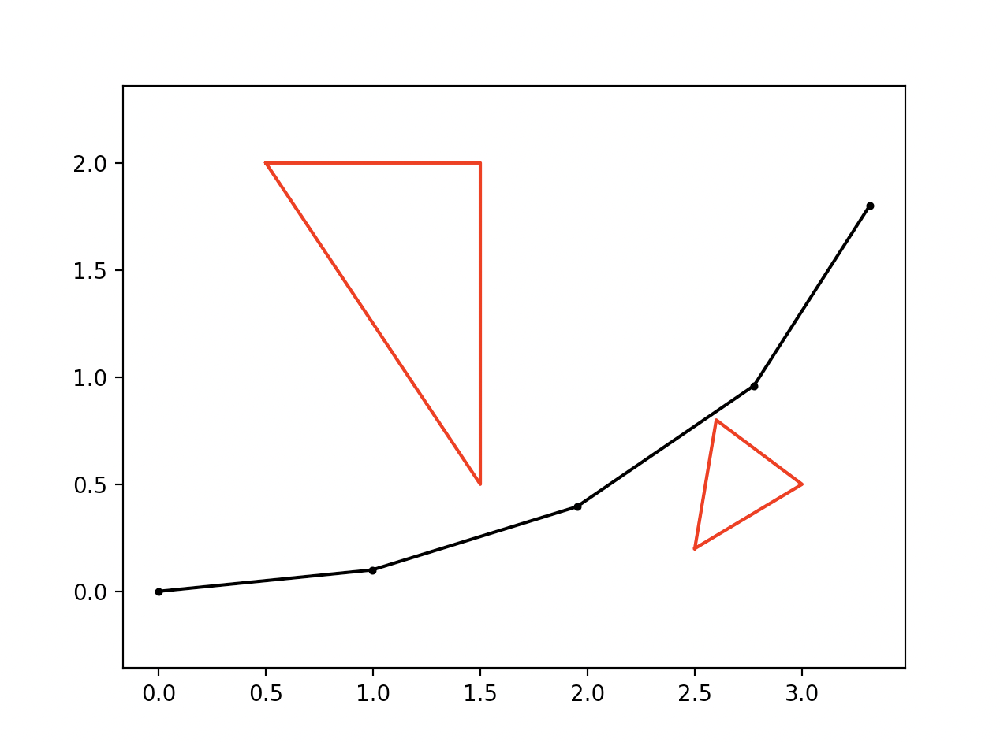
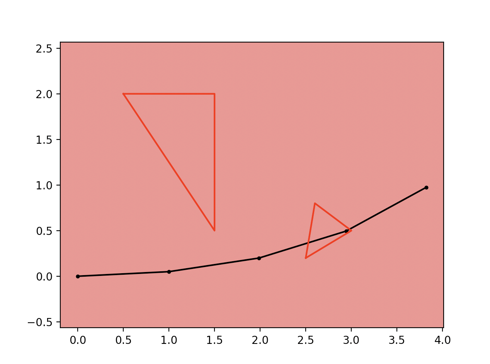
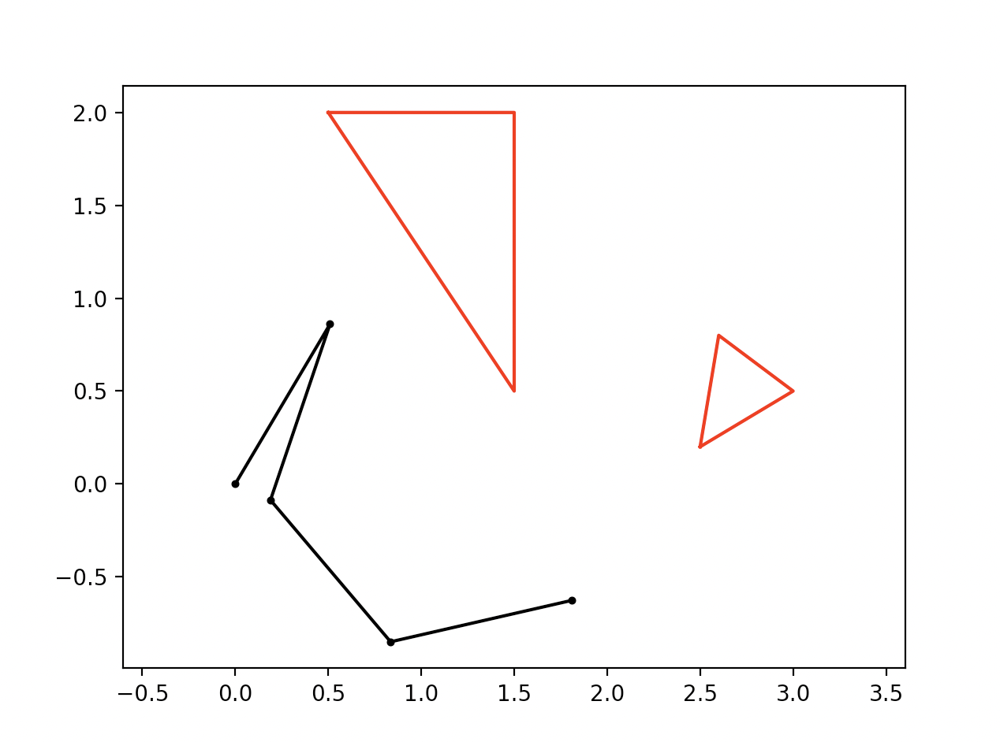
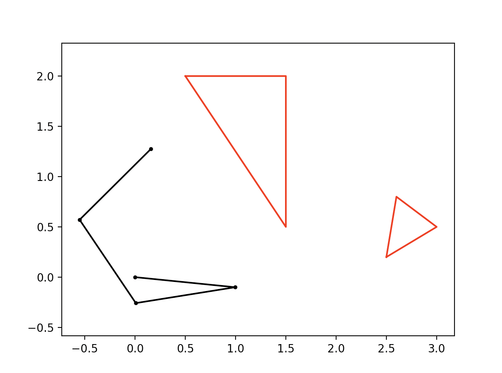
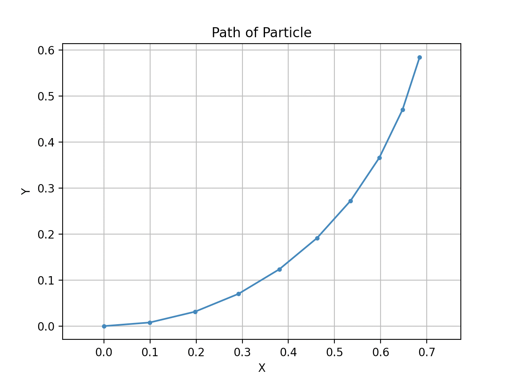
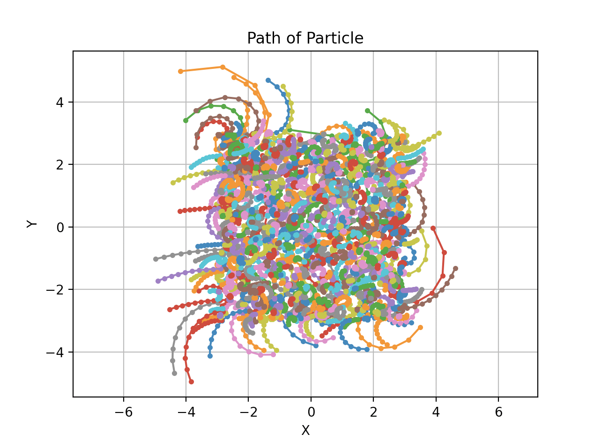
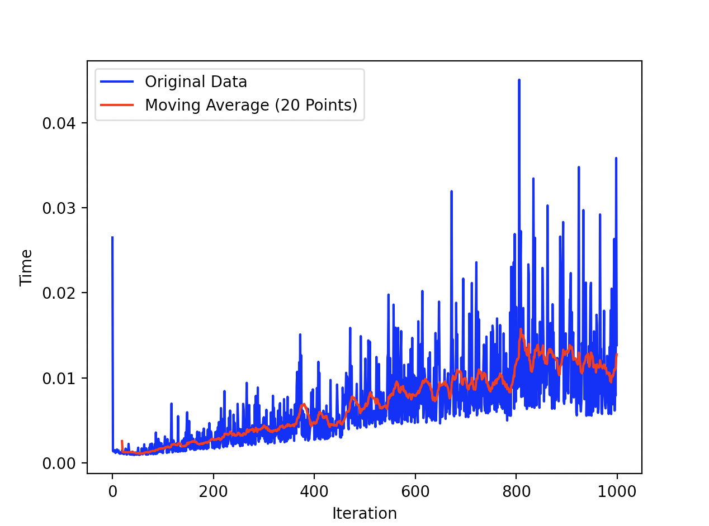

# PRM (Probabilistic Road Map)
### Carter Kruse (November 14, 2023)

### Instructions - Motion Planning
In this assignment, you will implement motion planners for two systems: a planar robot arm (with state given by the angles of the joints), and a steered car (with state given by the $ \left( x, y \right) $ location of a point on the robot, and the angle that the robot makes with the horizontal).

The instructions for this assignment are more brief, as by now you should have a sense of the type of questions that are interesting to explore in a report. Although no specific questions are asked here, a good report, for example, might compare different values of $ K $ for a K-PRM, explore different environments for RRT, and discuss.

### PRM (Arm Robot)
You will plan motions for 2R, 3R, and 4R planar arms. The base of the arm will be at location $ \left( 0, 0 \right) $, and the joint angles are measured counter-clockwise as described in class. For simplicity, each link on the arm will be represented by a line segment.

#### Kinematics
First, you will need to write a simple simulator for the arm that computes the locations of end points of the links for a configuration given by angles $ \theta_1 \ldots \theta_n $. You may wish to take a look at the slides for the robotics lectures if you have forgotten how to do this.

I would recommend also writing some drawing code at this point, so that you can view configurations. You should separate the drawing code and the code that computes the kinematics, since the kinematics are useful in the motion planning algorithm, and you do not want to slow the planner down by drawing graphics each time.

For graphics, you can use `matplotlib`, which you can install with `pip install matplotlib` from your command line. Keep the graphics simple.

#### Obstacles & Collision Detection
There are obstacles in the workspace; you could make them either small discs or small polygons for simplicity. The arm may have overlapping segments; we do not worry about self-collision. (You can imagine that the links are at slightly different z-heights.)

The motion planner needs to be able to detect if at some configuration (given by angles) there is a collision between the arm and the obstacles. You may use the [Shapely](https://pypi.org/project/shapely/) library to check for collisions between polygons.

Test your collision detection using the graphics by setting some configurations, and having the screen turn red for collision configurations.

#### Probabilistic Roadmap (PRM)
For the arm robot, you write a probabilistic road map planner, as described (here)[https://lavalle.pl/planning/node239.html]. You should implement the K-PRM version, in which the local planner only attempts to connect a vertex to its nearest $ K $ neighbors.

There are two phases in the planner:
1) Road map generation, in which a graph is created.
2) Query phase, in which specific paths from start to goal are created.

Start by generating the road map. To do this, you will need a sampling method to create the vertices of the graph in the configuration space, a collision detection method to check if these vertices are legal, and a local planner that can attempt to connect vertices.

You will need to also find the $ K $ nearest neighbors of a new vertex to connect to with the local planner. A simple (but inefficient) solution is to just loop over all previous vertices, using the local planner to check distances, and then sorting the resulting array.

#### Angular Distances
I prefer to use radians for distances. Notice that the angle $ 0 $ is very close to the angle $ 6.27 $, since the circle wraps around. There are two things to be careful of when computing angular distance.
1) Are the angles you are working with in some reasonable range? If you keep rotating a link by adding a small amount to the angle, you might pass $ 2 \pi $. Be careful that you choose a good convention for angles and stick to it (some choose $ 0 \ldots 2 \pi $; others use negative angles for the bottom half of the circle).
2) Consider two points on the unit circle. There are two ways to go on the circle between those two points: clockwise and counter-clockwise. The correct distance is the minimum of the two. Notice that if the distance in one direction is $ d $, then the distance in the other direction is $ 2 \pi − d $.

Write a nice angular distance function and test it in isolation, since it will be very useful for both the PRM and the RRT.

#### Query Phase / Testing
You should generate some interesting maps. Perhaps a "forest" of small rectangular or disc-shaped obstacles would be interesting. Show pictures of plans generated for your robot in your report. You do not need to animate anything; a good picture would perhaps show all the configurations on a single figure, illustrating how the arm moves from start to goal configuration.

As demonstrated later, I opted to include animation as an extension to the project, which produces a nice-looking result that is relatively intuitive, even for those that do not have as solid of an understanding of the project.

---

The following report addresses each of the files contained within the project individually, so as to provide an exhaustive overview of the contents of this project. The `astar_search.py`, `uninformed_search.py`, and `SearchSolution.py` files are not covered, as these were completed for previous projects.

Further, the `bidirectional_search.py`, `inverse_kinematics.ipynb`, and `multi_robot.py` files are to be considered for extra credit, so they will be addressed in the related section.

### `GraphProblem.py`
This file contains the structure that allows us to construct a given search problem, particularly in the context of a connected graph.

The constructor simply initializes the graph, start state, and goal state for the problem.

```python
def __init__(self, graph, start_state, goal_state):
    self.graph = graph
    self.start_state = start_state
    self.goal_state = goal_state
```

The `get_successors()` method simply considers the neighbors of a given vertex within a graph, as follows:

```python
# Determine the successors (neighbors) for a given state (node).
def get_successors(self, state):
    return list(self.graph[state])
```

To check the goal state, we simply return the boolean value of whether the state is the goal state (vertex) or not.

```python
# Test if the state is at the goal.
def is_goal_state(self, state):
    return state == self.goal_state
```

The file is dependent on the `heuristics.py` file for the `total_angular_distance()` metric, which is used as a heuristic against the goal stat for the A* search.

```python
# Calculate the angular heuristic.
def angular_heuristic(self, state):
    return total_angular_distance(state, self.goal_state)
```

Finally, the `to_string()` method is responsible for printing the details of the problem

```python
def __str__(self):
    # You may add further information about the problem state (if necessary).
    string =  "Graph Problem: " + str(self.start_state) + ' -> ' + str(self.goal_state)
    return string
```

### `heuristics.py`
This file contains the heuristics that are used, particularly to measure the distance between two angles, and to calculate the total angular distance between two series of angles.

As indicated by the assignment instructions, we must be careful when determining the difference between two angles due to the circular nature of radians. This is handled by considering the following, in the `angular_distance()` method.

```python
# Angular Distance
def angular_distance(theta_1, theta_2):
    # Calculate the angular distance between two angles (in radians).
    distance = abs(theta_1 - theta_2) % (2 * np.pi)

    # Return the shortest distance (circular).
    return min(distance, 2 * np.pi - distance)
```

Further, as indicated, the assignment required the ability to construct a metric that provided the distance between two different sets/series of angles, which relies on the previous `angular_distance()` method. This simply returns the sum (of the difference) along each dimension of the series of angles, and is written in the `total_angular_distance()` method.

```python
# Total Angular Distance
def total_angular_distance(angles_1, angles_2):
    total_distance = 0

    # Calculate the angular distance for each set of angles.
    for i in range(len(angles_1)):
        total_distance += angular_distance(angles_1[i], angles_2[i])
    
    # Return the total combined angular distance.
    return total_distance
```

As indicated by the assignment instructions, this code is tested in isolation, by running the following:

```python
# Test Code
    # Optional: Add to this to verify that the code works as expected.
if __name__ == "__main__":
    print('Angular Distance: ' + str(angular_distance(1, 5)))
    print('Total Angular Distance: ' + str(total_angular_distance([0.1, 0.2, 0.3, 0.4], [0.3, 0.2, 0.2, 0.4])))
    print()
```

The results are exactly as expected, indicating that the methods were implemented appropriately. These are given below.

```
Angular Distance: 2.2831853071795862
Total Angular Distance: 0.29999999999999993
```

### `kinematics.py`
This file contains all of the methods relevant to kinematics, specifically by describing the forward kinematics of the angles/lengths mapped to the physical locations, a method to check if there is a collision with any of the obstacles in the space, and a local planning method that serves to interpolate between points on a graph.

The `forward_kinematics()` method determines all of the joint locations for the various segments, according to the list of angles and lengths that are passed to the function as arguments.

```python
# Forward Kinematics
def forward_kinematics(angles, lengths):
    # Initialize the points array, along with the (x, y) location.
    points = [[0.0, 0.0]]
    x, y = 0.0, 0.0
    
    # Cycle through the angles/lengths.
    for i in range(len(angles)):
        # Update the (x, y) location according to the angles.
        x += lengths[i] * np.cos(np.sum(angles[:i + 1]))
        y += lengths[i] * np.sin(np.sum(angles[:i + 1]))

        # Add the point to the list.
        points.append([x, y])
    
    # Return the list of points.
    return np.array(points)
```

The `is_collision()` method returns true or false, depending on if a certain configuration (of angles) results in a planar arm that intersects any of the obstacles. For this, we use the Shapely library, specifically the `intersects()` method. In this, it is important to note that we must loop through each obstacle to consider all of the possible intersections.

```python
# Is Collision
def is_collision(angles, lengths, obstacles):
    # Calculate the points according to the forward kinematics model.
    points = forward_kinematics(angles, lengths)

    # Construct a line string from the points.
    arm = LineString(points)
    
    # Cycle through the obstacles.
    for obstacle in obstacles:
        # Check if the line string intersects the obstacle.
        if arm.intersects(obstacle):
            return True
    
    return False
```

Finally, the `interpolation()` method is responsible for creating a linear interpolation of points between two vertices, considering the idea that the vertices represent angles, and thus there is a closer distance from $ 0 $ to $ 2 \pi $ than $ 1, 2, etc. $. First, we make sure that the dimensions of the vertices match, and then determine the direction (clockwise or counter-clockwise) to make the interpolation, depending on the distance between the points.

Following this, we cycle through the number of points, and construct an interpolated point that depends on the angular distance, which allows us to essentially create a smooth mapping from one configuration state to another.

```python
# Interpolation
def interpolation(vertex_1, vertex_2, num_points = 20):
    # Ensure the dimensions match.
    assert len(vertex_1) == len(vertex_2)

    # Determine the length of the vector.
    vertex_length = len(vertex_1)

    # Determine the direction of interpolation (circular).
    directions = [1 for _ in range(num_points)]

    # Cycle through the angles.
    for i in range(vertex_length):
        # Calculate the difference between the angles (mod 2pi).
        difference = (vertex_2[i] - vertex_1[i]) % (2 * np.pi)

        # Reverse the direction if the distance is far.
        if difference > np.pi:
            directions[i] = -1
    
    # Perform interpolation (linear/circular) along each dimension.
    interpolated_points = []

    # Cycle through the number of points.
    for k in range(num_points):
        # Initialize an empty list.
        l = []

        # Cycle through the angles.
        for i in range(vertex_length):
            # Construct the interpolated point by adding a piece of the angular distance (with direction).
            l.append((vertex_1[i] + directions[i] * angular_distance(vertex_1[i], vertex_2[i]) * (k / num_points)) % (2 * np.pi))
        
        # Add the list to the interpolated points.
        interpolated_points.append(tuple(l))
    
    # Return the interpolated points.
    return interpolated_points
```

These methods are tested using the following code:

```python
# Test Code
    # Optional: Add to this to verify that the code works as expected.
if __name__ == "__main__":
    # VALID
    angles = [0.1 * i for i in range(1, 5)]
    lengths = [1.0 for _ in range(4)]
    obstacles = [Polygon([(0.5, 2.0), (1.5, 0.5), (1.5, 2.0)]),
                 Polygon([(2.5, 0.2), (3.0, 0.5), (2.6, 0.8)])]
    
    print('Points: ' + str(forward_kinematics(angles, lengths)))
    print()
    print('Collision: ' + str(is_collision(angles, lengths, obstacles)))
    print()

    # INVALID
    angles = [0.05 * i for i in range(1, 5)]
    lengths = [1.0 for _ in range(4)]
    obstacles = [Polygon([(0.5, 2.0), (1.5, 0.5), (1.5, 2.0)]),
                 Polygon([(2.5, 0.2), (3.0, 0.5), (2.6, 0.8)])]
    
    print('Points: ' + str(forward_kinematics(angles, lengths)))
    print()
    print('Collision: ' + str(is_collision(angles, lengths, obstacles)))
    print()

    # Interpolation
    print('Interpolated Points: ' + str(interpolation([0.1, 0.2, 0.3, 0.4], [0.3, 0.2, 0.2, 0.4], 5)))
    print()
```

This demonstrates that the collision detection and interpolation between configurations works exactly as expected.

```
Points: [[0.         0.        ]
 [0.99500417 0.09983342]
 [1.95034065 0.39535362]
 [2.77567627 0.9599961 ]
 [3.31597858 1.80146708]]

Collision: False

Points: [[0.         0.        ]
 [0.99875026 0.04997917]
 [1.98752134 0.1994173 ]
 [2.94285783 0.49493751]
 [3.82044039 0.97436305]]

Collision: True

Interpolated Points: [(0.1, 0.2, 0.3, 0.4), (0.14, 0.2, 0.27999999999999997, 0.4), (0.18, 0.2, 0.26, 0.4), (0.21999999999999997, 0.2, 0.24, 0.4), (0.26, 0.2, 0.22, 0.4)]
```

### `plotting.py`
This file contains all of the methods relevant to plotting, specifically using `matplotlib`. In this sense, we are able to separate the plotting from the other calculations for the forward kinematics/graph search, which allows us to speed up the runtime complexity, as we are not showing the results for every single iteration, only the end.

The `plot_chain()` method is responsible for calculating the points according to the forward kinematics and displaying the segments in a `matplotlib` graph, which is relatively simple.

```python
# Plot Chain
def plot_chain(angles, lengths):
    # Calculate the points according to the forward kinematics model.
    points = forward_kinematics(angles, lengths)
    x, y = zip(*points)

    # Display the chain, with the linkage points.
    plt.plot(x, y, color = 'black')
    plt.scatter(x, y, color = 'black', s = 7)
```

The `plot_obstacles()` method accomplishes a similar goal, though it loops through all of the obstacles and plots the exterior of them, in the color red.

```python
# Plot Obstacles
def plot_obstacles(obstacles):
    # Cycle through the obstacles.
    for obstacle in obstacles:
        # Plot the exterior of the obstacle (red).
        x, y = obstacle.exterior.xy
        plt.plot(x, y, color = 'red')
```

Finally, the `show_plot()` method is responsible for combining the two previous methods to show the environment and the robot arm. The background color of the plot is set according to whether or not there is a collision between the arm and the obstacles.

```python
# Show Plot
def show_plot(ax, angles, lengths, obstacles):
    # Check if there is a collision, update the background color.
    if is_collision(angles, lengths, obstacles):
        ax.set_facecolor('lightcoral')
    else:
        ax.set_facecolor('white')
    
    # Plot the chain and obstacles.
    plot_chain(angles, lengths)
    plot_obstacles(obstacles)

    # Make the axes equal in units.
    plt.axis('equal')
```

The following test code is used to demonstrate an example in which there is not a collision between the arm and the obstacles, and a situation in which there is a collision.

```python
# Test Code
    # Optional: Add to this to verify that the code works as expected.
if __name__ == "__main__":
    # VALID
    angles = [0.1 * i for i in range(1, 5)]
    lengths = [1.0 for _ in range(4)]
    obstacles = [Polygon([(0.5, 2.0), (1.5, 0.5), (1.5, 2.0)]),
                 Polygon([(2.5, 0.2), (3.0, 0.5), (2.6, 0.8)])]
    
    
    ax = plt.axes()
    show_plot(ax, angles, lengths, obstacles)
    plt.show()

    # INVALID
    angles = [0.05 * i for i in range(1, 5)]
    lengths = [1.0 for _ in range(4)]
    obstacles = [Polygon([(0.5, 2.0), (1.5, 0.5), (1.5, 2.0)]),
                 Polygon([(2.5, 0.2), (3.0, 0.5), (2.6, 0.8)])]
    
    
    ax = plt.axes()
    show_plot(ax, angles, lengths, obstacles)
    plt.show()
```





### `graph.py`
This file contains all of the methods relevant to constructing the graph of the configuration space, which we will later query to find the solution to the robot motion planning. In this sense, this is where we implement the probabilistic road map planner, specifically the K-PRM version, in which the local planner only attempts to connect a vertex to its nearest $ K $ neighbors. Typically, we following the pseudo-code located [here](https://lavalle.pl/planning/node240.html).

Let us go through each of the methods individually to give a top-down overview. The `generate_random_configuration()` method is responsible for simply returning a random configuration of angles, given the specified size, which indicates the appropriate number of segments.

```python
# Generate Random Configurations
def generate_random_configuration(size):
    # Construct a random configuration of angles with a given size.
    angles = np.random.uniform(0, 2 * np.pi, size)

    # Return the angles.
    return angles
```

To use a graph structure, we must define the `add_vertex()` and `add_edge()` methods, which are relatively straightforward. The former method simply adds a new vertex to the dictionary, where the vertex is represented as a tuple, and the assignment is in the form of a set to eliminate redundancy. The latter method checks to make sure both of the vertices are in the graph, before adding a connecting edge between both of them. In this case, the connecting edge is undirected, which seems to work for the implementation we are looking for.

```python
# Add Vertex
def add_vertex(graph, vertex, samples):
    # If the vertex is not the in the graph...
    if vertex not in graph:
        # Add the vertex to the graph.
        graph[vertex] = set()

        # Add the vertex to the samples.
        samples.append(vertex)

# Add Edge
def add_edge(graph, vertex_1, vertex_2):
    # If both vertices are in the graph...
    if vertex_1 in graph and vertex_2 in graph:
        # If the vertices are not equivalent.
        if vertex_1 != vertex_2:
            # Add an edge between the vertices.
            graph[vertex_1].add(vertex_2)
            graph[vertex_2].add(vertex_1)
```

Now, let us consider the `construct_vertex_set()` method, which is solely responsible for adding all of the vertices into the graph. We iterate through the number of samples, generating a random configuration of angles for each, and check to see if there is a collision with the obstacles for a given configuration of angles. If this is not the case, we are able to add the vertex to the graph, as it represents a vertex in free space, in terms of the configuration space.

```python

# Construct Vertex Set
def construct_vertex_set(graph, samples, num_samples, size, lengths, obstacles):
    i = 0
    # Construct the vertex set of the graph.
    while i < num_samples:
        # Create a random configuration of angles.
        angles = generate_random_configuration(size)

        # Check to make sure there is not a collision for the configuration.
        if not is_collision(angles, lengths, obstacles):
            # Convert the angles to a tuple to be placed in the dictionary.
            vertex = tuple(angles)

            # Add the vertex to the graph.
            add_vertex(graph, vertex, samples)
            i += 1
```

Now we consider the construction of the edge set, `construct_edge_set()`, which is slightly more tricky. The main idea is that we aim to iterate through the vertices in the graph, determine the $ K $ nearest neighbors (or approximate neighbors), and add edges just for those vertices. To this end, we do not construct a fully complete graph, as this would put major stress on the code, particularly the collision checking and searching algorithm.

In the code, you will notice there is extra code in the case where `approx` is true. This represents an extension that was implemented to invoke the approximate $ K $ nearest neighbors. As we will address that later, we do not intend to discuss it here. 

For the $ K $ nearest neighbors algorithm, we create a dictionary of vertex values, then cycle through the vertices of the graph, calculating the total angular distance for each pairing. Following this, we are able to sort the vertices by the minimum total angular distance, which allows us to determine the $ K $ nearest neighbors to any given vertex.

With the $ K $ nearest neighbors, we still need to check if we are actually able to add an edge between the vertices. To consider this, we use interpolation and collision checking to make sure that we are able to make a smooth transition from one configuration (vertex) to the next, which is not always the case. After this, the graph is fully constructed and we are able to run our query (search algorithm).

```python    
# Construct Edge Set
def construct_edge_set(graph, samples, tree, lengths, obstacles, k_nearest, approx):
    # Construct the edge set of the graph.
    for vertex in graph:
        if not approx:
            # Initialize the dictionary of vertex distances.
            vertex_distances = {}

            # Cycle through vertices of the graph.
            for v in graph:
                # Check if two vertices are the same.
                if v != vertex:
                    # Determine the total angular distance.
                    vertex_distances[v] = total_angular_distance(v, vertex)
            
            # Sort the vertices by the total angular distance (lambda function).
            sorted_vertices = sorted(vertex_distances.keys(), key = lambda v: vertex_distances[v])

            # Determine the K nearest vertices.
            for i in range(k_nearest):
                # Make sure there is a safe path between the vertices.
                if is_safe(lengths, obstacles, vertex, sorted_vertices[i]):
                    # Add an edge to the graph corresponding to the pairing.
                    add_edge(graph, vertex, sorted_vertices[i])
```

As implied, the `construct_edge_set()` method relies on a way to check if a given connection between vertices is safe or not, which we use the `is_safe()` method for. This is responsible for the interpolation between configurations (vertices/nodes in the graph), and the collision checking to see if we are able to make a smooth transition.

```python
# Is Safe
def is_safe(lengths, obstacles, vertex_1, vertex_2):
    # Cycle through the points in the interpolation between vertices.
    for point in interpolation(vertex_1, vertex_2):
        # Check if there is a collision with the obstacles.
        if is_collision(point, lengths, obstacles):
            return False
    
    return True
```

To test this code, we generate random configurations and check to see if the path between them is impacted by a collision or not. As indicated previously, we consider the linear interpolation for the path between vertices, taking into account the circular nature of the angles of the configuration.

```python
# Test Code
    # Optional: Add to this to verify that the code works as expected.
if __name__ == "__main__":
    num_segments = 4

    angles_1 = generate_random_configuration(num_segments)
    angles_2 = generate_random_configuration(num_segments)

    print()
    print('Random Configuration #1: ' + str(angles_1))
    print('Random Configuration #2: ' + str(angles_2))
    print()
    
    lengths = [1.0 for _ in range(num_segments)]
    obstacles = [Polygon([(0.5, 2.0), (1.5, 0.5), (1.5, 2.0)]),
                Polygon([(2.5, 0.2), (3.0, 0.5), (2.6, 0.8)])]
    
    print('Safe: ' + str(is_safe(lengths, obstacles, angles_1, angles_2)))
    print()
    
    ax = plt.axes()
    show_plot(ax, angles_1, lengths, obstacles)
    plt.show()

    ax = plt.axes()
    show_plot(ax, angles_2, lengths, obstacles)
    plt.show()
```

This produces the following result. The results may vary, as the random seed is not set.

```
Random Configuration #1: [1.03614401 3.35021186 1.02844126 1.0934345 ]
Random Configuration #2: [6.18278408 3.40050565 5.1473737  4.90058986]

Safe: True
```

**Configuration #1**



**Configuration #2**



This indicates that the smooth, linear translation from one configuration to the next, in terms of the angles provided, is not impacted by the obstacles.

### `main.py`
Finally, we come to the main script, which is the objective of this assignment. This script creates the problem constraints, including the environment (obstacles), the chain (number of segments), lengths of the segments, etc. We start by initializing the environment by creating a random "forest" of obstacles that the planar robot will have to navigate through.

```python
# Initialize
def initialize():
    # Define the x and y bounds with half-step intervals.
    x_bounds = [i for i in np.arange(-R, R, 0.5)]
    y_bounds = [i for i in np.arange(-R, R, 0.5)]

    # Create a series of 4 * R random obstacles.
    for _ in range(4 * R):
        # Generate random x and y values within the specified bounds.
        x = random.choice(x_bounds)
        y = random.choice(y_bounds)

        # Check to make sure the obstacles are not at the starting location.
        if (x, y) == (0.0, 0.0) or (x + 0.5, y) == (0.0, 0.0) or (x + 0.25, y + 0.5) == (0.0, 0.0):
            continue

        # Create a polygon using the specified form of a triangle.
        polygon = Polygon([(x, y), (x + 0.5, y), (x + 0.25, y + 0.5)])
        OBSTACLES.append(polygon)
```

Following this, we intialize the graph and define the start and goal states, according to what seems to be a challenging problem for a given environment. This is as follows.

```python
# Set the start and goal states, representing a configuration of angles.
if R == 2:
    start_state = tuple([0.5, 5.0])
    goal_state = tuple([2.0, 1.0])
elif R == 3:
    start_state = tuple([1.0, 0.5, 5.0])
    goal_state = tuple([4.0, 1.0, 1.0])
elif R == 4:
    start_state = tuple([0.1, 0.2, 0.3, 0.4])
    goal_state = tuple([5.0, 1.0, 5.0, 0.5])
else:
    print('Use a different R value.')
    exit(0)
```

After this, we must build the graph, using `build_graph()`. This involves constructing a vertex set with the given specifications, particularly one that is dependent on the number of segments in the chain. For fewer segments, we do not need as many samples, as there are less configurations that we must randomly generate in the configuration space. This is simply a result of the dimensionality of the problem.

Next, we construct the edge set, using $ K = 30 $ for the $ K $-nearest neighbors algorithm. In experimenting with the value of $ K $, this seems appropriate, considering that we end up cutting out a few of the edges to neighbors as a result of the transition between nodes/vertices in the graph not satisfying the collision constraints. Thus, we must maintain a careful balance between the number of configuration samples generated and teh number of neighbors we consider.

In testing this, 30 neighbors does not slow down the runtime of the program by too much, and yields a satisfactory solution for all values of $ R $. If we had less neighbors, it is possible that a solution would not be able to be found from the start to the goal, as a result of disconencted graph components. Increasing the value of $ K $ further proves unnecessary and ends up slowing the program down. The reason it is unnecessary is because we are already performing smoothing between states with the interpolation between vertices.

We keep track of the amount of time it takes to build the graph, in order to analyze the results from a numerical standpoint.

```python
# Build Graph
def build_graph(graph, samples, start_state, goal_state):
    # Initialize the start time.
    start_time = time.time()

    # Construct the vertex set, according to the specifications.
    construct_vertex_set(graph, samples, num_samples = 300 * R - 200, size = R, lengths = LENGTHS, obstacles = OBSTACLES)

    # Add the start state and goal state as vertices.
    add_vertex(graph, start_state, samples)
    add_vertex(graph, goal_state, samples)

    # Construct a spatial tree for the approximate nearest neighbors.
    tree = scipy.spatial.KDTree(samples)

    # Construct the edge set, according to the specifications.
    construct_edge_set(graph, samples, tree, lengths = LENGTHS, obstacles = OBSTACLES, k_nearest = 30, approx = APPROX_NEIGHBORS)

    # Calculate the end time.
    end_time = time.time()

    print()
    print('Time (Build Graph): ' + str(end_time - start_time))

```

Now, we may find the solution, using the graph, start state, and goal with a method called `find_solution()`. We initialize the graph problem and create a new timer to determine how long this takes. In the code shown below, A* search is used with the angular heuristic we previously defined, which is based on the total angular distance between states. We print out the solution and construct a proper path by interpolating between states/vertices/nodes in the graph, which allows for smooth transition of the robot arm from one state to another. Finally, we return the constructed path for plotting.

```python
# Find Solution
def find_solution(graph, start_state, goal_state):
    # Create the problem, with the graph, start state, and goal state.
    graph_problem = GraphProblem(graph, start_state, goal_state)

    # Initialize the start time.
    start_time = time.time()

    # solution = bfs_search(graph_problem)
    # solution = bidirectional_search(graph_problem)
    solution = astar_search(graph_problem, graph_problem.angular_heuristic)

    # Calculate the end time.
    end_time = time.time()

    print('Time (Search): ' + str(end_time - start_time))
    print()

    # Print the solution.
    print(solution)

    # Initalize the path.
    path = []

    # Construct the path, by interpolation between points.
    for i in range(len(solution.path) - 1):
        path.extend(interpolation(solution.path[i], solution.path[i + 1]))

    # Add the goal state to the solution path.
    path.append(goal_state)

    return path
```

To show the results of the algorithm, we use the `show_result()` method, which creates a `matplotlib` plot, specifically an animation. This animation depends on the `update()` method which is responsible for displaying the configuration of the robot arm, for each configuration in the path. In other words, we are able to visualize the motion of the robot arm using a time step between states, considering that we have already performed interpolation to determine the smooth path that the robot arm takes.

```python
# Show Result
def show_result(path):
    # Create a figure and axis for the animation.
    fig, ax = plt.subplots()

    # Create the animation.
    animation = FuncAnimation(fig, update, fargs = (ax, path), frames = len(path), interval = 100)

    # Show the plot.
    plt.show()

# Update
def update(frame, ax, path):
    ax.clear()

    # Determine the angles for the current frame.
    angles = path[frame]

    # Update the plot for each frame of the animation.
    show_plot(ax, angles, LENGTHS, OBSTACLES)
```

In this case, pictures of the plans generated for the robot are not necessary to include, as we provide nice animations that show the configurations that lead from the start state to the goal state, without intersecting with any of the obstacles. We display the results of various iterations of the algorithm as follows. The animations are provided in the `animations` folder.

```
R = 2
BFS
```

```
Time (Build Graph): 12.814547061920166
Time (Search): 0.0007522106170654297

----

Graph Problem: (0.5, 5.0) -> (2.0, 1.0)
Attempted with search method BFS
Number of Nodes Visited: 234
Solution Length: 7
Cost: 0
Path: [(0.5, 5.0), (0.8281103925769537, 4.500816564050804), (1.8402731284186513, 4.492807974253736), (2.5001963941841336, 4.866333020124977), (2.4858396474515345, 6.003369513657513), (2.491974829189338, 0.6703055822847769), (2.0, 1.0)]
```

```
R = 2
A* Search
```

```
Time (Build Graph): 12.538287878036499
Time (Search): 0.003398895263671875

----

Graph Problem: (0.5, 5.0) -> (2.0, 1.0)
Attempted with search method A* (angular_heuristic)
Number of Nodes Visited: 84
Solution Length: 7
Cost: 7
Path: [(0.5, 5.0), (1.34356710917938, 4.8457524974301815), (1.9590713045844454, 4.375255177675467), (2.5001963941841336, 4.866333020124977), (2.467254041367507, 6.009274385173978), (2.0932127243844723, 0.5095750619644228), (2.0, 1.0)]
```

```
R = 3
BFS
```

```
Time (Build Graph): 24.522688150405884
Time (Search): 0.001542806625366211

----

Graph Problem: (1.0, 0.5, 5.0) -> (4.0, 1.0, 1.0)
Attempted with search method BFS
Number of Nodes Visited: 639
Solution Length: 8
Cost: 0
Path: [(1.0, 0.5, 5.0), (1.3178978018579444, 0.7269848556339662, 3.6262791014106526), (0.9636450799444616, 1.254099547538831, 2.72052000314673), (0.8430378313843283, 1.9888865203223038, 1.8771035636602493), (1.4737204984679793, 2.1183703573082435, 1.1954420342035932), (2.3104065058222556, 1.8697840542681456, 0.9601186898835731), (3.6510454427830683, 1.5177476448246063, 1.0620179483308085), (4.0, 1.0, 1.0)]
```

```
R = 3
A* Search
```

```
Time (Build Graph): 24.809566259384155
Time (Search): 0.004249095916748047

----

Graph Problem: (1.0, 0.5, 5.0) -> (4.0, 1.0, 1.0)
Attempted with search method A* (angular_heuristic)
Number of Nodes Visited: 104
Solution Length: 8
Cost: 8
Path: [(1.0, 0.5, 5.0), (0.5454346214903756, 1.2091802482832334, 5.356066044430351), (0.3363365231855246, 1.1411671614925611, 0.7051261723205838), (0.07647363447726027, 2.028397807045724, 1.4424147954952211), (1.4737204984679793, 2.1183703573082435, 1.1954420342035932), (2.421977094319852, 1.5189632895652556, 1.179795571920565), (3.8884562861592036, 1.5304599805481875, 1.1160965950837272), (4.0, 1.0, 1.0)]
```

```
R = 4
BFS
```

```
Time (Build Graph): 48.238471031188965
Time (Search): 0.002438068389892578

----

Graph Problem: (0.1, 0.2, 0.3, 0.4) -> (5.0, 1.0, 5.0, 0.5)
Attempted with search method BFS
Number of Nodes Visited: 997
Solution Length: 9
Cost: 0
Path: [(0.1, 0.2, 0.3, 0.4), (6.210135977294426, 0.6411664555659314, 1.3124113649063995, 1.013537592683231), (6.282864677583723, 1.6957614719421723, 1.8960677331378781, 1.0366560788684072), (5.7383347519288455, 3.2960149228650573, 2.225660195943364, 0.7557248467615739), (5.839591306998407, 5.176604594853352, 1.5609341609350187, 0.5633687799413934), (5.2667358497935, 5.877874388929738, 0.8921273362102327, 1.6296937656359074), (5.06318440477344, 0.28318207725711475, 0.41725849149666977, 1.869365623677677), (4.831762732382367, 0.5225396722996543, 6.124688329332167, 0.30966841567152226), (5.0, 1.0, 5.0, 0.5)]
```

```
R = 4
A* Search
```

```
Time (Build Graph): 49.310927867889404
Time (Search): 0.022871017456054688

----

Graph Problem: (0.1, 0.2, 0.3, 0.4) -> (5.0, 1.0, 5.0, 0.5)
Attempted with search method A* (angular_heuristic)
Number of Nodes Visited: 515
Solution Length: 9
Cost: 9
Path: [(0.1, 0.2, 0.3, 0.4), (0.010919087719876644, 0.6277409409293316, 2.2849459403497137, 0.3845149004778738), (6.282864677583723, 1.6957614719421723, 1.8960677331378781, 1.0366560788684072), (5.7383347519288455, 3.2960149228650573, 2.225660195943364, 0.7557248467615739), (5.839591306998407, 5.176604594853352, 1.5609341609350187, 0.5633687799413934), (5.2667358497935, 5.877874388929738, 0.8921273362102327, 1.6296937656359074), (5.06318440477344, 0.28318207725711475, 0.41725849149666977, 1.869365623677677), (4.831762732382367, 0.5225396722996543, 6.124688329332167, 0.30966841567152226), (5.0, 1.0, 5.0, 0.5)]
```

Clearly, as the value of $ R $ increases, that is, the more segments we include for the robot arm, the more time it takes to construct and solve the graph. The testing demonstrates that creating the probabilistic road map is actually the most intensive process, likely as a result of the $ K $ neighbors algorithm, alongside having to check collision constraints. 

---

### Extra Credit/Bonus
The following implementations are designed to enhance the problem, thus meriting "extra credit" as defined by the outlines of the assignment. By going above and beyond to consider extensions to the problem, we consider a greater level of complexity for the problem. Due to the structure of our code, we are able to maintain much of the structure of the previously written code. The following represent implementation of a few of the ideas that were encouraged.

### Animation - Bonus #1
Given the nature of the assignment, animating the final result is a reasonable action to take to demonstrate the solution. This goes beyond simply showing the vertices of the configuration space of the robot arm (which would involve plotting the robot arm at given time steps).

The following Python code is responsible for the animation of the robot arm, particularly the animations that are shown in the `animations` folder.

```python
# Show Result
def show_result(path):
    # Create a figure and axis for the animation.
    fig, ax = plt.subplots()

    # Create the animation.
    animation = FuncAnimation(fig, update, fargs = (ax, path), frames = len(path), interval = 100)

    # Show the plot.
    plt.show()

# Update
def update(frame, ax, path):
    ax.clear()

    # Determine the angles for the current frame.
    angles = path[frame]

    # Update the plot for each frame of the animation.
    show_plot(ax, angles, LENGTHS, OBSTACLES)
```

In order for the animations to work, there must be interpolation between the nodes/verties/states of the graph. This allows for smooth transition between each state, and was dicussed previously in the report. Overall, the result is a final product that looks clean and properly demonstrates the results of the algorithm.

---

The following literature reviews are in line with the assignment extension suggestion, as follows: Read at least one paper on the RRT or one paper on the PRM. Briefly describe the main results of each paper in a previous work section of the report.

### Literature Review #1 - Bonus #2
The probabilistic road map (PRM) problem from this assignment is a well-known one, and it has been studied (relatively) extensively in the AI research community (alongside problems involving RRT and other methods). While there is no required additional part of the assignment, I found it relevant to complete a brief review of a somewhat-related paper.

Thus, a paper was chosen and read through enough to get a sense of the approach and major findings. In this report, we briefly discuss the paper. The discussion should describe the problem attacked by the paper, give a quick summary of the main result(s), and discuss the basic approach of the paper.

**Paper**: [*Visibility-Based Probabilistic Roadmaps For Motion Planning*](https://www.cs.cmu.edu/~motionplanning/papers/sbp_papers/PRM/prmsampling_06.pdf) by T. Siméon, J.P. Laumond, C. Nissoux

This paper provides an overview of a new probabilistic roadmap for motion planning problems that relies on "visibility", as opposed to traditional methods. The main result is a demonstration that a visibility domain is effective in determining the structure of free space, as opposed to traditional methods of random sampling. This allows a graph of the free space to be constructed rather quickly.

**Abstract**
"This paper presents a variant of probabilistic roadmap methods (PRM) that recently appeared as a promising approach to motion planning. We exploit a free-space structuring of the configuration space into visibility domains in order to produce small roadmaps, called visibility roadmaps. Our algorithm integrates an original termination condition related to the volume of the free space covered by the roadmap. The planner has been implemented within a software platform allowing us to address a large class of mechanical systems. Experiments show the efficiency of the approach, in particular for capturing narrow passages of collision-free configuration spaces."

The key idea is that in order to address the problem of motion planning for robots and other autonomous agents, a "visibility" probabilistic roadmap (PRM) may be used. This varient uses visibility information between random points in the environment to construt a roadmap graph that may be used for motion planning queries.

The authors allude to the idea that a basic approach involves generating random configurations in the environment, though there is inference that allows the algorithm to connect visible pairs with local paths to create a roadmap graph, and then use this graph to answer motion planning queries. To answer the queries, they follow the same method addressed in this assignment to connect start and goal configurations.

In summary, the paper addresses the approach of using visibility (in a high-dimensional space) to better caputre the connectivity of free space for a given problem. This has various implications for motion planning, and allows algorithms to run more efficiently in constructing a graph which represents free configuration space.

### Literature Review #2 - Bonus #3
The probabilistic road map (PRM) problem from this assignment is a well-known one, and it has been studied (relatively) extensively in the AI research community (alongside problems involving RRT and other methods). While there is no required additional part of the assignment, I found it relevant to complete a brief review of a somewhat-related paper.

Thus, a paper was chosen and read through enough to get a sense of the approach and major findings. In this report, we briefly discuss the paper. The discussion should describe the problem attacked by the paper, give a quick summary of the main result(s), and discuss the basic approach of the paper.

**Paper**: [*PRM-RL: Long-Range Robotic Navigation Tasks By Combining Reinforcement Learning & Sampling-Based Planning*](https://arxiv.org/pdf/1710.03937.pdf) by Aleksandra Faust, Oscar Ramirez, Marek Fiser, Kenneth Oslund, Anthony Francis, James Davidson, Lydia Tapia

This paper provides an overview of a way to address the problem of long-range navigation for robots, by proposing an approach that combines reinforcement leanring (RL) and sampling-based planning. The main result is the use of a probabilistic roadmap (PRM) that guides an RL agent in solving complex, long-range navigation tasks.

In this sense, the authors aim to leverage PRM's ability to effectively explore environments, alongside RL's ability to learn "control policies". This combination enables robotic navigation over longer distances, particularly in complex spaces (either configuration or otherwise).

**Abstract**
"We present PRM-RL, a hierarchical method for long-range navigation task completion that combines sampling-based path planning with reinforcement learning (RL). The RL agents learn short-range, point-to-point navigation policies that capture robot dynamics and task constraints without knowledge of the large-scale topology. Next, the sampling-based planners provide roadmaps which connect robot configurations that can be successfully navigated by the RL agent. The same RL agents are used to control the robot under the direction of the planning, enabling long-range navigation."

The key idea is to use probabilistic roadmaps (PRMs) for the sampling-based planner, while the RL agents are constructed using feature-based and deep neural net policies "in continuous state and action spaces". This methodology was tested in simulation and with the actual robot, on nagivation tasks with non-trivial robot dynamics, specifically "end-to-end differential drive indoor navigation in office environments, and aerial cargo delivery in urban environments with load displacement constraints."

The authors allude to the idea that combining PRMs and RL improves task completion versus either of the two methods individually. This idea maybe appleid to other situations, in which the capabilities of various algorithms may be enhanced by combining it with different algorithms.

In summary, the paper addresses an approach to achieving optimal performance for long-range navigation tasks for robots by using probabilistic road maps and RL to connect the free (configuration) space and appropriately plan the robot's motions.

### Bidirectional Search - Bonus #4
While uninformed search algorithms (such as BFS) and A* search certainly work for constructing a solution path given the graph, we are able to implement a bidirectional search, to explore from both the start and goal state to reach a solution in a faster time than a one-way search. This is due to the nature of the graph, particularly that the edges are undirected, indicating that the solution path extends in either direction from any given intermediary vertex/node/state.

The bidirectional search algorithm is implemented in `bidirectional_search.py`, and truthfully, took a signficant amount of time to figure out. The main idea is to reformulate the breadth-first search, but consider two frontiers, one expanding from the start state, and one expanding from the goal state. When the frontiers meet, we are able to construct a solution path from backtracing for both the forward and backward path to the goal and start states, respectively. The addition of these backtracing results is the full path.

The goal of bidirectional search is to ideally limit the amount of time spent searching a graph, as the branching factor does not play as significant of a role when finding a solution. That is, by exploring both frontiers, we are able to make sure that the frontier of each remains relatively small by the time we find a solution, which results in a faster runtime.

To accomplish the bidirectional search, we need a `SearchNode` as with the BFS.

```python
# The SearchNode class is useful to wrap state objects, pointing to parent nodes.
class SearchNode:
    # Each SearchNode except the root has a parent node and wraps a state object.
    def __init__(self, state, parent = None):
        self.state = state
        self.parent = parent
```

The full code for the bidirectional search is given as follows. Once again, we emphasize that the idea is to construct a frontier from the start state and the goal state, expanding each until we find a path that connects them. This was rather tricky to figure out, though the symmetry of the problem makes it relatively easy to complete the search algorithm once one direction is determined.

```python
# Bidirectional Search
    # This function is not recursive, though it performs memoizing (with a visited set) to prevent loops/cycle.
def bidirectional_search(search_problem):
    # Initialize the solution, given the search problem and BFS (bidirectional).
    solution = SearchSolution(search_problem, "BFS (bidirectional)")

    # Determine the initial and goal states of the search problem, using instance variables.
    initial_state = search_problem.start_state
    goal_state = search_problem.goal_state

    # Create SearchNodes and initialize the frontiers
    initial_node = SearchNode(initial_state)
    goal_node = SearchNode(goal_state)

    forward_frontier = deque([initial_node])
    backward_frontier = deque([goal_node])

    # Initialize the explored sets to keep track of visited states.
    forward_explored = set()
    backward_explored = set()

    # Add the initial/goal states to the explored sets.
    forward_explored.add(initial_state)
    backward_explored.add(goal_state)

    # While the frontiers (queues) contain values...
    while forward_frontier and backward_frontier:
        # Increment the counter.
        solution.nodes_visited += 1

        # Pop the leftmost node from the frontier.
        current_forward_node = forward_frontier.popleft()

        # Add the state to the explored set to prevent redundancy.
        forward_explored.add(current_forward_node.state)

        # Check if the current state is in the set of backward explored.
        if current_forward_node.state in backward_explored:
            # Determine which backward node matches the state of the current forward node.
            backward_node = next((node for node in backward_frontier if node.state == current_forward_node.state), None)

            # If so, construct the solution path and return the solution.
            solution.path = construct_solution_path(current_forward_node, backward_node)
            return solution
        
        # Generate the successor states and add them to the frontier.
        for next_state in search_problem.get_successors(current_forward_node.state):
            # Check if the next state is not in the explored set.
            if next_state not in forward_explored:
                # Create a new SearchNode with the appropriate parent and add it to the frontier.
                next_forward_node = SearchNode(next_state, parent = current_forward_node)
                forward_frontier.append(next_forward_node)
        
        # Pop the leftmost node from the frontier.
        current_backward_node = backward_frontier.popleft()

        # Add the state to the explored set to prevent redundancy.
        backward_explored.add(current_backward_node.state)

        # Check if the current state is in the set of forward explored.
        if current_backward_node.state in forward_explored:
            # Determine which forward node matches the state of the current backward node.
            forward_node = next((node for node in forward_frontier if node.state == current_backward_node.state), None)

            # If so, construct the solution path and return the solution.
            solution.path = construct_backward_solution_path(current_backward_node, forward_node)
            return solution
        
        # Generate the successor states and add them to the frontier.
        for next_state in search_problem.get_successors(current_backward_node.state):
            # Check if the next state is not in the explored set.
            if next_state not in backward_explored:
                # Create a new SearchNode with the appropriate parent and add it to the frontier.
                next_backward_node = SearchNode(next_state, parent = current_backward_node)
                backward_frontier.append(next_backward_node)

    # If the frontier is empty and no solution is found, return the solution (empty path).
    return solution
```

To construct the solution via backchaining, we need to consider whether we aim to construct forward solution path, or the backward solution path, depending on which frontier we are currently exploring at the moment that the frontiers meet. The symmetry of the problem results in methods that are rather alike, which are provided as follows:

```python
# Backchaining
def construct_solution_path(current_forward_node, backward_node):
    # Backtrack from the current node to construct the solution path.
    forward_path = []

    # Cycle through until the root (start node) is reached.
    while current_forward_node is not None:
        # Append the 'state' to the path. The 'append' function is faster than 'insert'.
        forward_path.append(current_forward_node.state)

        # Update the pointer of the current node.
        current_forward_node = current_forward_node.parent
    
    # Backtrack from the current node to construct the solution path.
    backward_path = []

    # Cycle through until the root (goal node) is reached.
    while backward_node is not None:
        # Append the 'state' to the path. The 'append' function is faster than 'insert'.
        backward_path.append(backward_node.state)

        # Update the pointer of the current node.
        backward_node = backward_node.parent
    
    # We should reverse the path at the end, as we use the 'append' function.
    return forward_path[::-1] + backward_path[1:]
```

```python
# Backchaining
def construct_backward_solution_path(current_backward_node, forward_node):
    # Backtrack from the current node to construct the solution path.
    backward_path = []

    # Cycle through until the root (goal node) is reached.
    while current_backward_node is not None:
        # Append the 'state' to the path. The 'append' function is faster than 'insert'.
        backward_path.append(current_backward_node.state)

        # Update the pointer of the current node.
        current_backward_node = current_backward_node.parent
    
    # Backtrack from the current node to construct the solution path.
    forward_path = []

    # Cycle through until the root (start node) is reached.
    while forward_node is not None:
        # Append the 'state' to the path. The 'append' function is faster than 'insert'.
        forward_path.append(forward_node.state)

        # Update the pointer of the current node.
        forward_node = forward_node.parent
    
    # We should reverse the path at the end, as we use the 'append' function.
    return forward_path[::-1] + backward_path[1:]
```

The results of the bidirectional search algorithm are given as follows, for the same conditions that we executed the BFS and A* search algorithms, to provide a comparison in searching speed. The animations are labelled with the suffix `_2d.mov`.

```
R = 2
Bidirectional Search
```

```
Time (Build Graph): 12.78088903427124
Time (Search): 0.009151935577392578

----

Graph Problem: (0.5, 5.0) -> (2.0, 1.0)
Attempted with search method BFS (bidirectional)
Number of Nodes Visited: 1577
Solution Length: 8
Cost: 0
Path: [(0.5, 5.0), (0.8281103925769537, 4.500816564050804), (1.34356710917938, 4.8457524974301815), (1.9590713045844454, 4.375255177675467), (2.3517722795753766, 4.7047753779647685), (2.234380729504747, 5.908908180814792), (2.0927533132414524, 0.6266405887071234), (2.0, 1.0)]
```

```
R = 3
Bidirectional Search
```

```
Time (Build Graph): 24.549597024917603
Time (Search): 0.03661680221557617

----

Graph Problem: (1.0, 0.5, 5.0) -> (4.0, 1.0, 1.0)
Attempted with search method BFS (bidirectional)
Number of Nodes Visited: 3833
Solution Length: 9
Cost: 0
Path: [(1.0, 0.5, 5.0), (1.426394728217639, 0.7864138903249468, 6.0583085758091375), (0.3414156499548941, 1.2566152267160373, 0.11637586681752995), (0.5867495902713136, 1.3851604318994157, 1.5679170410607774), (0.8430378313843283, 1.9888865203223038, 1.8771035636602493), (1.6894117466090857, 1.9224385030707327, 1.9193433404579086), (2.8265633801133703, 1.4270924451789126, 1.832592364125295), (4.24449649596813, 1.1812889259023518, 1.6459001813820116), (4.0, 1.0, 1.0)]
```

```
R = 4
Bidirectional Search
```

```
Time (Build Graph): 24.549597024917603
Time (Search): 0.03661680221557617

----

Graph Problem: (1.0, 0.5, 5.0) -> (4.0, 1.0, 1.0)
Attempted with search method BFS (bidirectional)
Number of Nodes Visited: 3833
Solution Length: 9
Cost: 0
Path: [(1.0, 0.5, 5.0), (1.426394728217639, 0.7864138903249468, 6.0583085758091375), (0.3414156499548941, 1.2566152267160373, 0.11637586681752995), (0.5867495902713136, 1.3851604318994157, 1.5679170410607774), (0.8430378313843283, 1.9888865203223038, 1.8771035636602493), (1.6894117466090857, 1.9224385030707327, 1.9193433404579086), (2.8265633801133703, 1.4270924451789126, 1.832592364125295), (4.24449649596813, 1.1812889259023518, 1.6459001813820116), (4.0, 1.0, 1.0)]
```

Interestingly, we see that there is actually an increase in the runtime for searching the graph, indicating that maybe exploring the forward and backward frontier does not result in a solution that is faster, but one that is slower, as a result of the extra computation. This may not be the case for larger graphs with a higher branching factor, though this remains uncertain.

### Approximate Nearest Neighbors - Bonus #5
As stated in the project instructions, finding nearest neighbors by looping over all points is expensive. A better solution would use some sort of approximate nearest neighbor (ANN) algorithm to find the neighbors in logarithmic or amortized constant time.

The approximate nearest neighbors algorithm was implemented in `graph.py`, specifically the `construct_edge_set()`, as that is where we apply the $ K $ nearest neighbors algorithms. When we are constructing the edges between vertices/nodes, we must determine the $ K $ nearest points, as determined by the total angular distance. Instead of looping over all the vertices in the graph, the following uses SciPy's implementaiton of a KD tree. We construct this tree in the `graph.py` file, though it is initialized in the `main.py` script. 

```python
# Construct a spatial tree for the approximate nearest neighbors.
tree = scipy.spatial.KDTree(samples)
```

As indicated, SciPy's implementation for the approximate nearest neighbor yields a faster result, as we do not have to loop over all of the neighbors in the tree... there is underlying structure that adds the vertices in such a way that extraction according to the approximate nearest neighbors algorithm is rather fast. For small problems, this does not have as much of an effect, though it certainly would for more sizable problems.

```python
for vertex in graph:
    # Use the SciPy implementation for approximate nearest neighbors.
    distances, neighbors = tree.query([vertex], k = k_nearest + 1, distance_upper_bound = np.inf)

    # Exclude the vertex itself.
    neighbors = neighbors[0][1:]

    # Cycle through the approximate K nearest neighbors.
    for n in neighbors:
        # Determine the vertex according to the samples.
        neighbor = samples[n]

        # Make sure there is a safe path between the vertices.
        if is_safe(lengths, obstacles, vertex, neighbor):
            # Add an edge to the graph corresponding to the pairing.
            add_edge(graph, vertex, neighbor)
```

To apply the approximate nearest neighbors algorithm, a significant amount of the code had to be refactored to allow a `samples` list to exist, which stores the vertices of the graph outside of the graph structure itself for easy look up. This meant modifying the `add_vertex()` method, alongside the `construct_edge_set()` method to allow for this new parameter. The approximate nearest neighbors algorithm may be toggled on/off using the boolean variable `APPROX_NEIGHBORS = False` defined at the top of the `main.py` file.

We provide a comparison (for BFS search) with the approximate nearest neighbors algorithm toggled off/on to indicate the slight decrease in runtime while building the graph, indicating and increase in efficiency. In this case, we do not create further animations, though you are certianly welcome to!

```
R = 4
BFS
K Nearest Neighbors
```

```
Time (Build Graph): 51.371633768081665
Time (Search): 0.0024271011352539062

----

Graph Problem: (0.1, 0.2, 0.3, 0.4) -> (5.0, 1.0, 5.0, 0.5)
Attempted with search method BFS
Number of Nodes Visited: 997
Solution Length: 9
Cost: 0
Path: [(0.1, 0.2, 0.3, 0.4), (6.210135977294426, 0.6411664555659314, 1.3124113649063995, 1.013537592683231), (6.282864677583723, 1.6957614719421723, 1.8960677331378781, 1.0366560788684072), (5.7383347519288455, 3.2960149228650573, 2.225660195943364, 0.7557248467615739), (5.839591306998407, 5.176604594853352, 1.5609341609350187, 0.5633687799413934), (5.2667358497935, 5.877874388929738, 0.8921273362102327, 1.6296937656359074), (5.06318440477344, 0.28318207725711475, 0.41725849149666977, 1.869365623677677), (4.831762732382367, 0.5225396722996543, 6.124688329332167, 0.30966841567152226), (5.0, 1.0, 5.0, 0.5)]
```

```
R = 4
BFS
Approximate Nearest Neighbors
```

```
Time (Build Graph): 46.59552788734436
Time (Search): 0.0024650096893310547

----

Graph Problem: (0.1, 0.2, 0.3, 0.4) -> (5.0, 1.0, 5.0, 0.5)
Attempted with search method BFS
Number of Nodes Visited: 989
Solution Length: 9
Cost: 0
Path: [(0.1, 0.2, 0.3, 0.4), (0.2686887200425035, 0.002308088861844258, 1.7199128350692334, 2.9034444086391766), (0.18497875588463208, 0.08634097568373329, 3.6929301436988258, 3.411683148256793), (0.8885310700004094, 0.846960151562698, 4.995352509059708, 2.3198985888291728), (1.0981248886503474, 2.445005285676243, 5.982489005984928, 1.885137298580128), (2.483075378632574, 2.8174113594914902, 5.379532420425371, 1.692632507109419), (2.9013087547417884, 2.729070814644401, 5.8232716987948, 0.843234554133926), (4.857593722734888, 1.362635968936389, 5.674656591282226, 0.2697006437559893), (5.0, 1.0, 5.0, 0.5)]
```

Clearly, the time to build the graph was slightly less for the approximate nearest neighbors, indicating an improvement in performance. This impact would be seen in a more drastic sense for problems that are even more computationally difficult. The reason why there is not that much change in performance for this small example is likely due to the increase in overhead required for the SciPy implementation, though this is clearly worth taking in exchange for faster runtimes for more complex problems.

### Trajectories (Multiple Robots) & Time Analysis - Bonus #6
To further explore forward kinematics, I found it relevant to consider the motion of a particle at a position $ (x, y) $ with constant velocity $ v $ and constant angular velocity $ w $. We are able to write a forward kinematics model for this particular problem set-up, which allows us to determine the trajectory of the particle over time. The implementation of this is provided in `multi_robot.py`.

The reason for such naming is if we reduce a robot to a single point location, this model works rather well, as it allows us to determine the trajectory from the linear and angular velocity. Further, as we will see later on, many particles/robots were plotted within an environment, with the restriction that their trajectories may not overlap.

In this, we analyze the amount of time it takes to create a new valid trajectory, as the state space becomes increasingly filled with the trajectories of other particles/robots.

---

The `compute_trajectory()` method is responsible for determining the path according to the starting $ (x, y) $ position, velocity, angular velocity, total time, and time step. Initially, we compute the number of steps and initialize an empty list to represent the path. Then we cycle through the different time steps, and compute the new position of the particle at a given time step, appending this to the list that represents the path of the particle.

```python
# Compute Trajectory
def compute_trajectory(x, y, v, w, total_time, dt):
    # Determine the number of steps to take.
    num_steps = int(total_time / dt)

    # Initialize an empty path of points and times.
    path = []

    # Cycle through the different time steps.
    for step in range(num_steps):
        # Add the corresponding points to the path.
        path.append([x + v * step * dt * np.cos(w * step * dt),
                     y + v * step * dt * np.sin(w * step * dt)])
    
    # Return the calculated path/trajectory.
    return path
```

The `plot_trajectory()` method takes in a path and is responsible for plotting the points on the path in a trajectory-like manner, using `matplotlib`. To do so, we must extract the $ (x, y) $ coordinates from the path, followed by actually plotting the values, with the appropriate characteristics.

```python
# Plot Trajectory
def plot_trajectory(path):
    # Extract the x and y coordinates.
    x_coordinates = [point[0] for point in path]
    y_coordinates = [point[1] for point in path]

    # Plot the path.
    plt.plot(x_coordinates, y_coordinates, marker = 'o', linestyle = '-', markersize = 3)

    # Titles & Labels
    plt.title('Path of Particle')
    plt.xlabel('X')
    plt.ylabel('Y')

    # Grid
    plt.grid(True)

    # Make the axes equal in units.
    plt.axis('equal')
```

The `detect_collision()` method matches what we previously had, although this time the obstacles being considered are other trajectories, which are simply LineStrings. Regardless, the Shapely library still works well to handle this case, and gives the appropriate results.

```python
# Detect Collision
def detect_collision(points, obstacles):
    # Construct a line string from the points.
    arm = LineString(points)
    
    # Cycle through the obstacles.
    for obstacle in obstacles:
        # Check if the line string intersects the obstacle.
        if arm.intersects(obstacle):
            return True
    
    return False
```

The `moving_average()` method is relatively straightforward and simply involves using convolution to compute the moving average of a series of data, for a given window size. This is used particularly in the time analysis, which we will see later on in the plot.

```python
# Moving Average
def moving_average(data, window_size):
    return np.convolve(data, np.ones(window_size) / window_size, mode = 'valid')
```

---

Now, let us first consider our testing code, which is as follows:

```python
# Test Code
    # Optional: Add to this to verify that the code works as expected.
if __name__ == "__main__":
    # Simple Version (1 Robot)
    path = compute_trajectory(x = 0, y = 0, v = 1, w = np.pi / 4, total_time = 1, dt = 0.1)
    print("Path: ", path)
    print()

    # Show the trajectory of the robot in space.
    plot_trajectory(path)
    plt.show()

    times = plot_multiple()
    time_analysis(times)
```

This testing code generates a sample trajectory for a single particle, and then does so for many particles, and provides a graph of the time analysis as described above, which we will go into further detail into. The single trajectory is shown below, as is the path output to the terminal.



```
Path:  [[0.0, 0.0], [0.0996917333733128, 0.007845909572784495], [0.19753766811902757, 0.03128689300804618], [0.291710976119303, 0.07003360915677163], [0.3804226065180614, 0.12360679774997896], [0.46193976625564337, 0.1913417161825449], [0.5346039145130208, 0.27239429984372815], [0.5968481150478646, 0.36574899530116417], [0.647213595499958, 0.4702282018339785], [0.6843653690400279, 0.5845032434971653]]
```

The `plot_multiple()` method is used for generating the trajectories of multiple particles/robots in the state space, alongside providing the data for the time analysis. In this method, we loop through 1000 iterations, computing the trajectory for a random start state (including the $ (x, y) $ location, velocity, and angular velocity). If there is not a collision between the trajectory and other trajectories, we add the path to the list of obstacles and plot the trajectory. Finally, we capture the amount of time it took for the program to find a trajectory that did not intersect any of the previous trajectories.

```python
# Plot Multiple
def plot_multiple():
    # Multi Robot (& Time Analysis)
    robot_paths = []
    times = []

    # Initialize the start time.
    start_time = time.time()

    i = 0
    while i < 1000:
        # Compute the trajectory, for a random (x, y), velocity, and angular velocity.
        path = compute_trajectory(x = np.random.uniform(-3, 3), y = np.random.uniform(-3, 3), v = np.random.uniform(-3, 3), w = np.random.uniform(0, 2 * np.pi), total_time = 1, dt = 0.1)
        
        # If there is not a collision with previous paths...
        if not detect_collision(path, robot_paths):
            i += 1

            ## Add the robot path to the list.
            robot_paths.append(LineString(path))

            # Plot the trajectory
            plot_trajectory(path)

            # Add the time to find a solution to the list.
            end_time = time.time()
            times.append(end_time - start_time)

            # Reset the start time.
            start_time = time.time()
    
    plt.show()
    return times
```

The results of the code are shown in the following picture:



Finally, as implied, we consider the amount of time it takes for the program to find a (random) configuration/trajectory that does not conflict with those that already exist within the space. The code to do so is provided by the `time_analysis()` method, in which we compute the rolling/moving average with a window size of 20, plot the original times collected from the previous method, and plot the moving average.

``` python
def time_analysis(times, window_size = 20):
    # Calculate the moving average.
    rolling_average = moving_average(times, window_size)
    
    # Plot the original data.
    plt.plot(times, color = 'blue', label = 'Original Data')

    # Plot the moving average.
    plt.plot(np.arange(window_size - 1, len(times)), rolling_average, color = 'red', label = f'Moving Average ({window_size} Points)')

    # Labels
    plt.xlabel('Iteration')
    plt.ylabel('Time')
    plt.legend()

    plt.show()
```

The results of this plot are shown as follows:



Evidently, from this plot, we are able to see that as more and more trajectories are added to the space, it becomes increasingly less likely that a random trajectory will not intersect with one that is already in the space. In this sense, it takes longer for the program to "find" a new trajectory that satisfies the constraints of the problem. This highlights an issue with a highly constrained space... the time it takes to find new vertices in a configuration space increases linearly/exponentially.

### Inverse Kinematics - Bonus #7
Inverse kinematics is a mathematical approach used in robotics, computer graphics, biomechanics, and animation to determine the joint parameters of a mechanism that will position its end effector (such as a robot' hand or a character's limb) at a desired location and orientation. In other words, while forward kinematics calculates the position and orientation of the end effector based on the joint angles, inverse kinematics does the opposite by determining the joint angles needed to achieve a specific end effector pose.

#### Components:
**End Effector:** The end effector is the part of the robotic system that performs the task. It could be a robot's hand, a tool, or any part of the mechanism that needs to be accurately positioned.

**Joint Parameters:** A robot is typically made up of a series of interconnected links and joints. Joint parameters include joint angles, lengths, and types (revolute or prismatic).

**Forward Kinematics:** Forward kinematics describes the relationship between joint parameters and the resulting position and orientation of the end effector. It is the process of calculating the end effector's pose given the joint parameters.

**Inverse Kinematics:** Inverse kinematics, on the other hand, involves solving equations to determine the joint parameters needed to achieve a desired end effector pose.

#### Mathematical Formulation:
The inverse kinematics problem is essentially a set of equations that need to be solved. The complexity of these equations depends on the robot's kinematic structure. For simple robots with few joints, analytical solutions may be possible. However, for more complex systems, numerical methods or iterative algorithms are often employed.

#### Methods for Solving Inverse Kinematics:
**Analytical Methods:** Closed-form solutions are possible for some simple robotic structures. These solutions are direct mathematical formulas that provide the joint angles for a given end effector pose.

**Numerical Methods:** Numerical methods, such as iterative techniques like the Newton-Raphson method, can be used to approximate solutions for more complex systems. These methods iteratively refine the joint angles until a solution is found.

**Optimization Techniques:** Optimization algorithms, like gradient descent, can be employed to minimize the difference between the desired end effector pose and the one obtained through forward kinematics.

#### Challenges and Considerations:
**Multiple Solutions:** Inverse kinematics problems can have multiple solutions, leading to different joint configurations for the same end effector pose.

**Singularities:** Certain configurations can result in singularities, where the solution is not unique or the robot loses degrees of freedom.

**Real-World Constraints:** Physical constraints, such as joint limits, workspace limits, and collision avoidance, need to be considered in practical applications.

**Computational Complexity:** Depending on the complexity of the robot and the desired accuracy, solving inverse kinematics equations can be computationally intensive.

#### Applications:
**Robotics:** Inverse kinematics is widely used in robotics for tasks such as robot arm control, trajectory planning, and motion control.

**Computer Graphics and Animation:** Inverse kinematics is employed in animation to control the movement of characters and objects realistically.

**Biomechanics:** In biomechanics, inverse kinematics is used to analyze and model human or animal movement.

**Virtual Reality and Simulation:** Inverse kinematics is crucial for creating realistic movements and interactions in virtual environments.

In summary, inverse kinematics is a fundamental concept in the field of robotics and computer graphics, playing a crucial role in enabling precise control and movement of robotic systems and animated characters. The choice of method for solving inverse kinematics depends on the complexity of the system and the specific requirements of the application.

The file `inverse_kinematics.ipynb` goes into further depths about the mathematical formulations of inverse kinematics and the various methods of solving them, particularly numerical, with Newton's method for underconstrained systems.

*[Please view the file to see the extensive exploration completed in studying inverse kinematics. This took a fair amount of time to complete.]*
